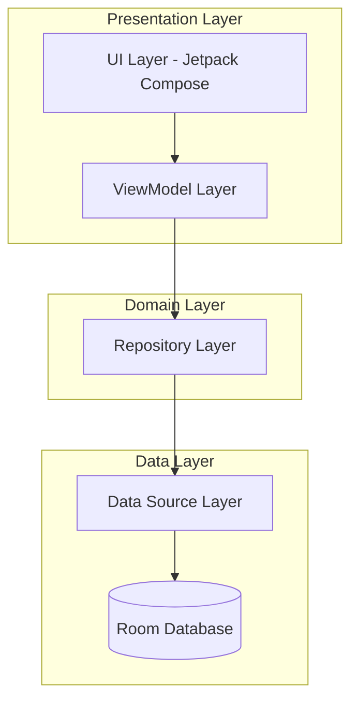
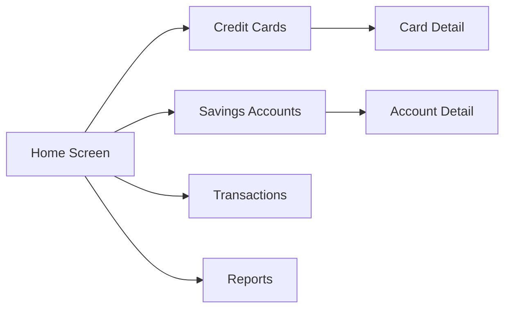

# Design Document - Aplicación de Finanzas Personales Android

## Overview

La aplicación será desarrollada como una aplicación nativa de Android utilizando Kotlin y Jetpack Compose para la interfaz de usuario. La arquitectura seguirá el patrón MVVM (Model-View-ViewModel) recomendado por Google para aplicaciones Android modernas, con una capa de datos basada en Room para persistencia local.

### Technology Stack

- **Lenguaje**: Kotlin
- **UI Framework**: Jetpack Compose con Material Design 3
- **Arquitectura**: MVVM (Model-View-ViewModel)
- **Base de Datos**: Room (SQLite)
- **Inyección de Dependencias**: Hilt
- **Navegación**: Jetpack Navigation Compose
- **Notificaciones**: WorkManager + NotificationManager
- **Gráficos**: Vico (Charting library for Compose)
- **Manejo de Fechas**: kotlinx-datetime

## Architecture

### High-Level Architecture



### Module Structure

```
app/
├── data/
│   ├── local/
│   │   ├── dao/
│   │   ├── entities/
│   │   └── database/
│   ├── repository/
│   └── models/
├── domain/
│   ├── usecases/
│   └── models/
├── ui/
│   ├── screens/
│   │   ├── home/
│   │   ├── cards/
│   │   ├── accounts/
│   │   ├── transactions/
│   │   └── reports/
│   ├── components/
│   ├── theme/
│   └── navigation/
└── utils/
```

## Components and Interfaces

### 1. Data Layer

#### Database Entities

**CreditCardEntity**
```kotlin
@Entity(tableName = "credit_cards")
data class CreditCardEntity(
    @PrimaryKey(autoGenerate = true)
    val id: Long = 0,
    val name: String,
    val totalLimit: Double,
    val availableLimit: Double,
    val cutoffDay: Int, // Día del mes (1-31)
    val paymentDay: Int, // Día del mes (1-31)
    val color: String, // Color hex para UI
    val createdAt: Long,
    val updatedAt: Long
)
```

**SavingsAccountEntity**
```kotlin
@Entity(tableName = "savings_accounts")
data class SavingsAccountEntity(
    @PrimaryKey(autoGenerate = true)
    val id: Long = 0,
    val name: String,
    val balance: Double,
    val color: String,
    val createdAt: Long,
    val updatedAt: Long
)
```

**PurchaseEntity**
```kotlin
@Entity(
    tableName = "purchases",
    foreignKeys = [
        ForeignKey(
            entity = CreditCardEntity::class,
            parentColumns = ["id"],
            childColumns = ["cardId"],
            onDelete = ForeignKey.CASCADE
        )
    ]
)
data class PurchaseEntity(
    @PrimaryKey(autoGenerate = true)
    val id: Long = 0,
    val cardId: Long,
    val description: String,
    val totalAmount: Double,
    val installments: Int, // Número de cuotas
    val installmentAmount: Double, // Valor de cada cuota
    val purchaseDate: Long,
    val createdAt: Long
)
```

**ExpenseEntity**
```kotlin
@Entity(
    tableName = "expenses",
    foreignKeys = [
        ForeignKey(
            entity = SavingsAccountEntity::class,
            parentColumns = ["id"],
            childColumns = ["accountId"],
            onDelete = ForeignKey.CASCADE
        )
    ]
)
data class ExpenseEntity(
    @PrimaryKey(autoGenerate = true)
    val id: Long = 0,
    val accountId: Long,
    val description: String,
    val amount: Double,
    val category: ExpenseCategory,
    val expenseDate: Long,
    val createdAt: Long
)

enum class ExpenseCategory {
    FOOD, TRANSPORT, ENTERTAINMENT, SERVICES, SHOPPING, HEALTH, OTHER
}
```

#### DAOs (Data Access Objects)

**CreditCardDao**
```kotlin
@Dao
interface CreditCardDao {
    @Query("SELECT * FROM credit_cards ORDER BY name ASC")
    fun getAllCards(): Flow<List<CreditCardEntity>>
    
    @Query("SELECT * FROM credit_cards WHERE id = :cardId")
    suspend fun getCardById(cardId: Long): CreditCardEntity?
    
    @Insert
    suspend fun insertCard(card: CreditCardEntity): Long
    
    @Update
    suspend fun updateCard(card: CreditCardEntity)
    
    @Delete
    suspend fun deleteCard(card: CreditCardEntity)
    
    @Query("UPDATE credit_cards SET availableLimit = :newLimit WHERE id = :cardId")
    suspend fun updateAvailableLimit(cardId: Long, newLimit: Double)
}
```

**PurchaseDao**
```kotlin
@Dao
interface PurchaseDao {
    @Query("SELECT * FROM purchases WHERE cardId = :cardId ORDER BY purchaseDate DESC")
    fun getPurchasesByCard(cardId: Long): Flow<List<PurchaseEntity>>
    
    @Query("SELECT * FROM purchases ORDER BY purchaseDate DESC")
    fun getAllPurchases(): Flow<List<PurchaseEntity>>
    
    @Insert
    suspend fun insertPurchase(purchase: PurchaseEntity): Long
    
    @Update
    suspend fun updatePurchase(purchase: PurchaseEntity)
    
    @Delete
    suspend fun deletePurchase(purchase: PurchaseEntity)
    
    @Query("""
        SELECT * FROM purchases 
        WHERE cardId = :cardId 
        AND purchaseDate <= :cutoffDate
        ORDER BY purchaseDate DESC
    """)
    suspend fun getPurchasesForCutoff(cardId: Long, cutoffDate: Long): List<PurchaseEntity>
}
```

**SavingsAccountDao** y **ExpenseDao** seguirán patrones similares.

#### Repository Layer

**FinanceRepository**
```kotlin
interface FinanceRepository {
    // Credit Cards
    fun getAllCreditCards(): Flow<List<CreditCard>>
    suspend fun getCreditCardById(id: Long): CreditCard?
    suspend fun addCreditCard(card: CreditCard): Long
    suspend fun updateCreditCard(card: CreditCard)
    suspend fun deleteCreditCard(card: CreditCard)
    
    // Savings Accounts
    fun getAllSavingsAccounts(): Flow<List<SavingsAccount>>
    suspend fun addSavingsAccount(account: SavingsAccount): Long
    suspend fun updateSavingsAccount(account: SavingsAccount)
    suspend fun deleteSavingsAccount(account: SavingsAccount)
    
    // Purchases
    fun getPurchasesByCard(cardId: Long): Flow<List<Purchase>>
    suspend fun addPurchase(purchase: Purchase): Long
    suspend fun deletePurchase(purchase: Purchase)
    
    // Expenses
    fun getExpensesByAccount(accountId: Long): Flow<List<Expense>>
    fun getAllExpenses(): Flow<List<Expense>>
    suspend fun addExpense(expense: Expense): Long
    suspend fun deleteExpense(expense: Expense)
    
    // Financial Calculations
    suspend fun calculateTotalAvailable(): Double
    suspend fun calculateTotalDebt(): Double
    suspend fun calculateRealAvailable(): Double
    suspend fun calculatePaymentForCutoff(cardId: Long, cutoffDate: LocalDate): Double
}
```

### 2. Domain Layer

#### Use Cases

**CalculateFinancialSummaryUseCase**
- Calcula el resumen financiero completo (disponible, deuda, disponible real)
- Combina datos de cuentas de ahorros y tarjetas de crédito

**CalculateCardPaymentUseCase**
- Calcula el monto a pagar en el próximo corte de una tarjeta
- Considera todas las cuotas que vencen en ese período

**AddPurchaseUseCase**
- Registra una compra y actualiza el cupo disponible de la tarjeta
- Valida que haya cupo suficiente

**AddExpenseUseCase**
- Registra un gasto y actualiza el saldo de la cuenta
- Valida que haya saldo suficiente

**GetUpcomingPaymentsUseCase**
- Obtiene todos los pagos próximos de tarjetas
- Ordena por fecha de pago

### 3. Presentation Layer

#### Screen Structure

**HomeScreen**
- Muestra resumen financiero principal
- Cards con: Disponible Total, Deuda Total, Disponible Real
- Lista de próximos pagos
- Acceso rápido a acciones comunes

**CreditCardsScreen**
- Lista de todas las tarjetas de crédito
- Cada card muestra: nombre, cupo usado/total, próximo pago
- FAB para agregar nueva tarjeta
- Click en tarjeta abre detalle

**CreditCardDetailScreen**
- Información completa de la tarjeta
- Historial de compras
- Gráfico de uso del cupo
- Botón para registrar compra
- Opciones de editar/eliminar

**SavingsAccountsScreen**
- Lista de cuentas de ahorros
- Cada card muestra: nombre, saldo actual
- FAB para agregar nueva cuenta
- Click en cuenta abre detalle

**AccountDetailScreen**
- Información de la cuenta
- Historial de gastos
- Gráfico de evolución del saldo
- Botón para registrar gasto
- Opciones de editar/eliminar

**TransactionsScreen**
- Vista unificada de todas las transacciones
- Filtros por tipo, fecha, categoría
- Búsqueda

**ReportsScreen**
- Gráficos de gastos por categoría
- Gráficos de uso de tarjetas
- Calendario de pagos
- Filtros por período

#### Navigation Graph



#### UI Components

**FinancialSummaryCard**
- Componente reutilizable para mostrar métricas financieras
- Props: título, monto, icono, color

**CreditCardItem**
- Componente para mostrar tarjeta en lista
- Muestra progreso visual del cupo usado

**TransactionItem**
- Componente para mostrar transacción en lista
- Diferencia visualmente entre compras y gastos

**ChartCard**
- Wrapper para gráficos con título y opciones
- Usa Vico para renderizar gráficos

**AddTransactionDialog**
- Dialog modal para agregar compras/gastos
- Validación de formulario

## Data Models

### Domain Models

```kotlin
data class CreditCard(
    val id: Long = 0,
    val name: String,
    val totalLimit: Double,
    val availableLimit: Double,
    val cutoffDay: Int,
    val paymentDay: Int,
    val color: String,
    val createdAt: Instant,
    val updatedAt: Instant
) {
    val usedLimit: Double
        get() = totalLimit - availableLimit
    
    val usagePercentage: Float
        get() = (usedLimit / totalLimit * 100).toFloat()
}

data class Purchase(
    val id: Long = 0,
    val cardId: Long,
    val description: String,
    val totalAmount: Double,
    val installments: Int,
    val installmentAmount: Double,
    val purchaseDate: Instant
) {
    fun getRemainingInstallments(currentDate: Instant): Int {
        // Lógica para calcular cuotas restantes
    }
}

data class FinancialSummary(
    val totalAvailable: Double,
    val totalDebt: Double,
    val realAvailable: Double,
    val savingsAccounts: List<SavingsAccount>,
    val creditCards: List<CreditCard>
)

data class PaymentDue(
    val card: CreditCard,
    val amount: Double,
    val dueDate: LocalDate,
    val purchases: List<Purchase>
)
```

## Error Handling

### Error Types

```kotlin
sealed class FinanceError {
    data class InsufficientFunds(val available: Double, val required: Double) : FinanceError()
    data class InsufficientCredit(val available: Double, val required: Double) : FinanceError()
    data class InvalidAmount(val message: String) : FinanceError()
    data class DatabaseError(val message: String) : FinanceError()
    data class NotFound(val entityType: String, val id: Long) : FinanceError()
}

sealed class Result<out T> {
    data class Success<T>(val data: T) : Result<T>()
    data class Error(val error: FinanceError) : Result<Nothing>()
}
```

### Error Handling Strategy

1. **Repository Layer**: Captura excepciones de base de datos y las convierte en `FinanceError`
2. **Use Cases**: Valida reglas de negocio y retorna `Result<T>`
3. **ViewModel**: Maneja errores y actualiza UI state
4. **UI**: Muestra mensajes de error apropiados usando Snackbar o Dialog

## Testing Strategy

### Unit Tests

**Repository Tests**
- Mockear DAOs
- Verificar transformación de entities a domain models
- Verificar cálculos financieros

**Use Case Tests**
- Mockear repository
- Verificar lógica de negocio
- Verificar validaciones

**ViewModel Tests**
- Mockear use cases
- Verificar actualización de UI state
- Verificar manejo de errores

### Integration Tests

**Database Tests**
- Usar Room in-memory database
- Verificar operaciones CRUD
- Verificar queries complejas
- Verificar relaciones entre entidades

### UI Tests

**Compose Tests**
- Verificar renderizado de componentes
- Verificar interacciones de usuario
- Verificar navegación

## Design System

### Color Palette

```kotlin
// Light Theme
val PrimaryLight = Color(0xFF006C4C)
val SecondaryLight = Color(0xFF4D6357)
val TertiaryLight = Color(0xFF3D6373)
val BackgroundLight = Color(0xFFFBFDF9)
val SurfaceLight = Color(0xFFFBFDF9)

// Dark Theme
val PrimaryDark = Color(0xFF6FDB9F)
val SecondaryDark = Color(0xFFB1CCBE)
val TertiaryDark = Color(0xFFA8CEE0)
val BackgroundDark = Color(0xFF191C1A)
val SurfaceDark = Color(0xFF191C1A)

// Semantic Colors
val SuccessColor = Color(0xFF4CAF50)
val ErrorColor = Color(0xFFE53935)
val WarningColor = Color(0xFFFFA726)
val InfoColor = Color(0xFF29B6F6)
```

### Typography

```kotlin
val Typography = Typography(
    displayLarge = TextStyle(
        fontSize = 57.sp,
        lineHeight = 64.sp,
        fontWeight = FontWeight.Normal
    ),
    headlineMedium = TextStyle(
        fontSize = 28.sp,
        lineHeight = 36.sp,
        fontWeight = FontWeight.Bold
    ),
    titleLarge = TextStyle(
        fontSize = 22.sp,
        lineHeight = 28.sp,
        fontWeight = FontWeight.SemiBold
    ),
    bodyLarge = TextStyle(
        fontSize = 16.sp,
        lineHeight = 24.sp,
        fontWeight = FontWeight.Normal
    ),
    labelMedium = TextStyle(
        fontSize = 12.sp,
        lineHeight = 16.sp,
        fontWeight = FontWeight.Medium
    )
)
```

### Component Specifications

**Card Elevation**: 2.dp para cards normales, 4.dp para cards elevados
**Corner Radius**: 16.dp para cards, 12.dp para botones
**Spacing**: 8.dp, 16.dp, 24.dp, 32.dp (múltiplos de 8)
**Icon Size**: 24.dp para iconos estándar, 48.dp para iconos grandes

## Notifications

### Notification Strategy

**WorkManager Implementation**
- Programar workers diarios para verificar fechas próximas
- Worker se ejecuta una vez al día a las 9:00 AM
- Verifica tarjetas con corte/pago en los próximos 3 días

**Notification Channels**
```kotlin
- CHANNEL_CUTOFF: Notificaciones de corte de tarjeta
- CHANNEL_PAYMENT: Notificaciones de pago de tarjeta
```

**Notification Content**
- Título: "Pago próximo - [Nombre Tarjeta]"
- Texto: "Debes pagar $[monto] el [fecha]"
- Action: Abrir detalle de la tarjeta

## Data Persistence

### Backup Strategy

**Export Format**: JSON
```json
{
  "version": "1.0",
  "exportDate": "2025-11-15T10:30:00Z",
  "creditCards": [...],
  "savingsAccounts": [...],
  "purchases": [...],
  "expenses": [...]
}
```

**Export/Import Flow**
1. Usuario selecciona "Exportar datos" en configuración
2. Sistema serializa toda la base de datos a JSON
3. Archivo se guarda en Downloads con nombre "finanzas_backup_[fecha].json"
4. Para importar, usuario selecciona archivo y sistema valida formato
5. Opción de reemplazar o fusionar datos existentes

## Performance Considerations

1. **Lazy Loading**: Usar LazyColumn para listas largas
2. **Pagination**: Implementar paginación para historial de transacciones
3. **Caching**: Room automáticamente cachea queries
4. **Debouncing**: Aplicar debounce en búsquedas y filtros
5. **Background Processing**: Cálculos complejos en coroutines con Dispatchers.Default

## Security Considerations

1. **Local Storage**: Datos almacenados en SQLite con protección del sistema Android
2. **No Network**: Sin riesgo de interceptación de datos
3. **Backup Encryption**: Considerar encriptar archivos de backup (fase futura)
4. **Screen Security**: FLAG_SECURE para prevenir screenshots (opcional)

## Accessibility

1. **Content Descriptions**: Todos los elementos interactivos tienen contentDescription
2. **Semantic Properties**: Usar semantics en Compose para screen readers
3. **Touch Targets**: Mínimo 48.dp para todos los elementos táctiles
4. **Contrast Ratios**: Cumplir WCAG AA (4.5:1 para texto normal)
5. **Text Scaling**: Soportar escalado de texto del sistema
